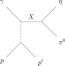
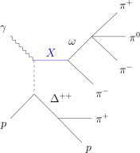

# Comparison repository for GlueX amplitude models

[](https://github.com/astral-sh/ruff)
[](https://pixi.sh)
[](https://github.com/prettier/prettier)

This repository was created during PWA working group meetings for GlueX at Jefferson Lab, July 31st to August 4th, 2023. Live notes for these discussions can be found [here](https://hackmd.io/@QHYjhejHTIWXL2MltV3WNQ/r17prtBo3) on HackMD. Each meeting was organised like a 'hackathon' and the results of these programming sessions can be found on [compwa.github.io/gluex-amplitude](https://compwa.github.io/gluex-amplitude).

The main target for the week was to implement a simple intensity function for two-pseudoscalar system with photo-production:


where $Z_{l}^{m}(\Omega,\Phi)=Y_{l}^{m}(\Omega)e^{-i\Phi}$ is a phase-rotated spherical harmonic, $\Omega$ is the solid angle, $\Phi$ is the angle between the production and polarization planes, $P_{\gamma}$ is the polarization magnitude, $[l]$ are the partial wave amplitudes, $m$ is the associated m-projection, $k$ refers to a spin flip ($k=1$) or non-flip ($k=0$) at the nucleon vertex, and $\kappa$ is an overall phase space factor.

The details for this model have been worked out in [10.1103/PhysRevD.100.054017](https://doi.org/10.1103/PhysRevD.100.054017) (2019).



The amplitude model is implemented in [AmpTools](https://github.com/mashephe/AmpTools) and symbolically in Python using [SymPy](https://docs.sympy.org) with additional tools from [`amptools`](https://ampform.rtfd.io) ([ComPWA Project](https://compwa.github.io)). Dynamics are not yet included (model-indepedent by binning over energy). So we are just comparing linar combinations of spherical harmonics, but the comparison can be extended by investigating final states with a vector meson and/or parametrizing dynamic lineshapes.



## Installation

This repository comes with [AmpTools](https://github.com/mashephe/AmpTools) as a submodule, under [`extern/AmpTools`](./extern/AmpTools). If you clone this repository as:

```shell
git clone https://github.com/compwa/gluex-amplitude --recurse-submodules
```

you should get AmpTools as well. Alternatively, if you have already cloned the repository, you can initialize the submodule with:

```shell
git submodule update --init
```

All required dependencies can be installed within an isolated virtual environment through the [Pixi](https://pixi.sh) package manager. Installation instructions can be found [here](https://pixi.sh/latest/installation).

To build all source code, simply run:

```shell
pixi run build
```

Other Pixi tasks can be listed with

```shell
pixi task list
```

In particular, you can build the website with the Python notebook with the `doc` task:

```shell
pixi run doc
```

Open `docs/_build/html/index.html` to view the resulting HTML pages. In VSCode, you can view the output HTML files by searching for "Live Preview: Start Server" through the [command pallette](https://code.visualstudio.com/api/ux-guidelines/command-palette) (`Ctrl+Shift+P`).

Finally, to automatically run style checks over files you are committing, it is recommended to install [`pre-commit`](https://pre-commit.com):

```shell
pixi global install --expose pre-commit pre-commit-uv
pre-commit install --install-hooks
```
