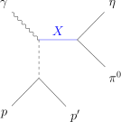

# Comparison repository for GlueX amplitude models

This repository was created during PWA working group meetings for GlueX at Jefferson Lab, July 31st to August 4th, 2023. Live notes for these discussions can be found [here](https://hackmd.io/@QHYjhejHTIWXL2MltV3WNQ/r17prtBo3) on HackMD. Each meeting was organised like a 'hackathon' and the results of these programming sessions can be found on [compwa.github.io/gluex-amplitude](https://compwa.github.io/gluex-amplitude).

The main target for the week was to implement a simple intensity function for two-pseudoscalar system with photo-production:


where $Z_{l}^{m}(\Omega,\Phi)=Y_{l}^{m}(\Omega)e^{-i\Phi}$ is a phase-rotated spherical harmonic, $\Omega$ is the solid angle, $\Phi$ is the angle between the production and polarization planes, $P_{\gamma}$ is the polarization magnitude, $[l]$ are the partial wave amplitudes, $m$ is the associated m-projection, $k$ refers to a spin flip ($k=1$) or non-flip ($k=0$) at the nucleon vertex, and $\kappa$ is an overall phase space factor.



The amplitude model is implemented in [AmpTools](https://github.com/mashephe/AmpTools) and symbolically in Python using [SymPy](https://docs.sympy.org) with additional tools from [`amptools`](https://ampform.rtfd.io) ([ComPWA](https://compwa-org.rtfd.io)). Dynamics are not yet included (model-indepedent by binning over energy). So we are just comparing linar combinations of spherical harmonics, but the comparison can be extended by investigating final states with a vector meson and/or parametrizing dynamic lineshapes.


## Installation

### C++ implementation

This repository comes with [AmpTools](https://github.com/mashephe/AmpTools) as a submodule. If you clone this repository as:

```shell
git clone https://github.com/compwa/gluex-amplitude --recurse-submodules
```

you should get AmpTools as well. Navigate to [`extern/AmpTools`](./extern/AmpTools) for further build instructions. Additionally, you need to have ROOT installed. Official installation instructions can be found [here](https://root.cern/install), but alternatively, you can install ROOT in your conda environment (see [Python implementation](#python-implementation)) as follows:

```shell
conda activate gluex-amplitude
conda install root -c conda-forge
```

The benefit of AmpTools as a sub-module and installing ROOT into the conda environment is that you have out-of-the-box [language navigation in VSCode](https://code.visualstudio.com/docs/cpp/cpp-ide#_navigate-source-code).

To build all source code, you first need to compile AmpTools. Either do this by cloning AmpTools and following the instructions, or with:

```shell
cd extern/AmpTools
make
```

You can then compile the code for this repository by navigating back to the root directory (`cd ../../`) and running:

```
make
```

### Python implementation

Install Conda (recommended: [Miniconda](https://docs.conda.io/en/latest/miniconda.html#linux-installers)), then just create a Conda environment from [`environment.yml`](./environment.yml):

```shell
conda env create
conda activate gluex-amplitude
pre-commit install --install-hooks  # optional
```

The Python implementation mainly consists of Jupyter notebooks located under the [`docs`](./docs) folder. It's best to view, run, and edit them with VSCode or with

```shell
jupyter lab
```

You can also run all notebooks and render them as static HTML pages with [Jupyter Book](https://jupyterbook.org) as follows:

```shell
jb build docs/ -W
```

Open `docs/_build/html/index.html` to view the resulting HTML pages. In VSCode, you can view the output HTML files by searching for "Live Preview: Start Server" through the [command pallette](https://code.visualstudio.com/api/ux-guidelines/command-palette) (`Ctrl+Shift+P`).
